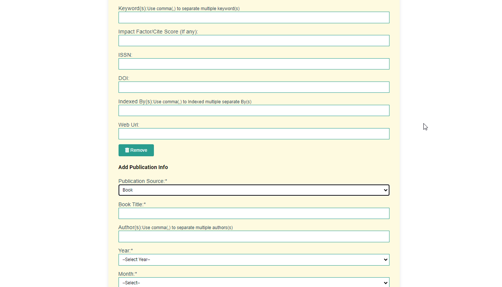

# SE-Projects
# Bangladesh Open University Tutor Registration System

## 1. System Overview

**1.1. Purpose:**

The purpose of the Bangladesh Open University Tutor Registration System is to allow tutors to apply for registration and process their applications through a multi-level approval system.

**1.2. Process Flow:**

Tutor Application:

Step 1: Tutors interested in registering access the online application form.

Step 2: They fill out their personal details, qualifications, and other required information.

Step 3: Submit the application.

Review Process:

Step 4: The application is first reviewed by a primary reviewer (e.g., a lower-level coordinator).

Step 5: If approved, the application is forwarded to a superior for further review.

Step 6: The superior reviews and either approves or rejects the application.

Step 7: The final decision is made by the highest authority (e.g., a dean or head of department).

Notification:

Step 8: The selected tutor receives a notification of their acceptance via email or another preferred method.

Step 9: If rejected, the applicant receives feedback and possible next steps.
Online Recruitment System for Tutors: Step-by-Step Approval Process

Roles and Responsibilities:

Tutor:

Initial application submission.

Providing necessary documents and information.

Coordinator:

Reviewing the application for completeness and initial eligibility.

Forwarding the application to the Dean.

Dean:

Assessing the application based on academic criteria and department needs.

Approving or rejecting the application.

Forwarding approved applications to the SSS.

SSS (Student Services Section):

Conducting further administrative review.

Ensuring compliance with university policies.

Forwarding the application to the Dean of SST/Pro VC.

Dean SST/Pro VC:

Final review and decision-making authority.

Approving the application and ensuring all criteria are met.

Returning the application to SSS for final processing.

SSS:

Finalizing the administrative process.

Ensuring all necessary documentation is complete.

Forwarding the application back to the Dean.

Dean:

Confirming the final approval.

Returning the application to the Coordinator.

Coordinator:

Informing the Tutor of the decision.

Coordinating any further steps required for onboarding.

Tutor:

Completing any additional steps required for registration.

Starting the tutoring engagement.

Project Workflow

Tutor Application Submission:

Tutors submit their applications online through a dedicated portal.

Required documents include CV, academic certificates, and a statement of purpose.

Initial Review by Coordinator:

Coordinator checks the application for completeness.

If complete, the application is forwarded to the Dean.

Dean's Assessment:

Dean reviews the academic credentials and fit for the department.

Approved applications are sent to SSS for further review.

Administrative Review by SSS:

SSS ensures the application adheres to university policies.

After review, the application is forwarded to the Dean of SST/Pro VC.

Final Decision by Dean SST/Pro VC:

Dean SST/Pro VC conducts a final review.

Approved applications are sent back to SSS for processing.

SSS Final Processing:

SSS completes any remaining administrative tasks.

The application is returned to the Dean.

Dean's Confirmation:

Dean confirms the final approval.

Application is sent to the Coordinator.

Coordinator Notification:

Coordinator informs the Tutor of the decision.

Provides instructions for the next steps.

Tutor Onboarding:

Tutor completes onboarding steps.

Begins tutoring sessions.

## 2. Late Registration System

**2.1. System Overview:**

The purpose of the Late Registration System is to automate the process for students who miss the regular registration deadline and need to apply for late registration.

**2.2. Process Flow:**

Student Application:

Step 1: The student accesses the late registration application form.

Step 2: They fill out their student ID, course details, reason for late registration, and any required supporting documents.

Step 3: Submit the application.

Review Process:

Step 4: The application is first reviewed by the course coordinator.

Step 5: The course coordinator either approves or denies the application based on the provided information and reason for delay.

Step 6: If approved, the application is forwarded to a higher authority, such as the Vice Chancellor or other relevant office.

Step 7: The final decision is made, and the student is either granted late registration or informed of alternative options.

Notification:

Step 8: The student receives a notification regarding the decision.

Step 9: If approved, instructions for completing the late registration are provided.

## 3. Implementation Steps

**3.1. Design the System:**

Database Schema: Design tables for tutor applications, student applications, and review stages.

User Interfaces: Create forms for tutors and students to submit their applications.

Admin Panels: Develop interfaces for reviewers to manage and process applications.

**3.2. Develop the System:**

Frontend: Build the user interfaces using PHP and CSS.

Backend: Implement server-side logic to handle form submissions, review processes, and notifications.

Database: Set up and connect the database to store and manage application data.

**3.3. Testing:**

Functionality Testing: Ensure all features work as expected, including form submissions and review workflows.

User Testing: Test with real users (tutors, students, reviewers) to ensure the system meets their needs and is user-friendly.

**3.4. Deployment:**

Hosting: Deploy the system on a web server.

Monitoring: Monitor the system for any issues and gather user feedback for future improvements.

## 4. Documentation and Training

**4.1. User Documentation:**

Create guides for tutors, students, and reviewers on how to use the system.

**4.2. Training:**

Provide training sessions or materials for users to familiarize themselves with the new system.

